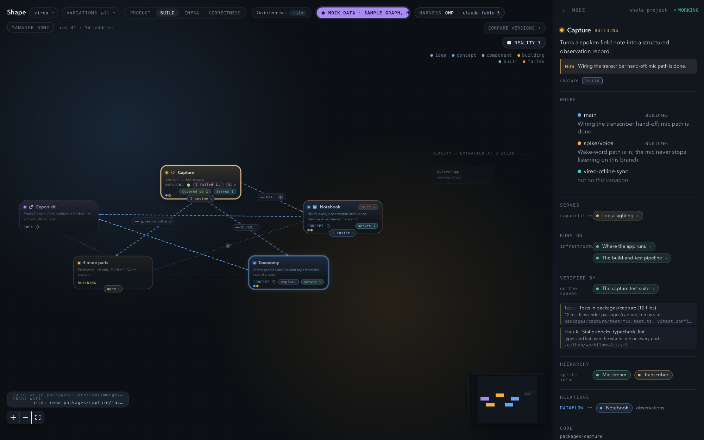

# Shape

Builders don't look at code any more — they look at the *shape* of the product they are
building. Shape is that view: an agent-maintained, live picture of the system, rendered as
drillable bubbles. The agent declares the **intent** layer (what each part of the system
promises, in plain English) while it works; a **reality** layer is derived mechanically from
the code itself (workspace packages, the imports between them, the infrastructure its config
files prove, the checks that attest it); where the two disagree, **drift** is rendered on the
bubble instead of quietly rotting like a README diagram. The canvas is a picture, not a
console: it is where you read what each part claims, what the code proves, and what every
session is doing right now. Agents are directed where they actually run — your terminal, or
the manager beside it — and never from the browser.



## Requirements

- **Node 26 or newer.** Shape has no build step for the bridge, the shared contract or the
  link: Node runs the TypeScript sources directly (`node src/index.ts`), which needs Node's
  built-in type stripping.
- **pnpm 11.** Pinned by `packageManager` in `package.json`, so `corepack enable` is enough
  to get the right version.
- **A coding harness that reports in**, one or both of:
  - `omp` — [oh-my-pi](https://github.com/can1357/oh-my-pi); the session loads Shape's own
    extension, which every builder the project's manager launches is handed automatically.
  - `claude` — Claude Code; the link ships the MCP server and the hooks it loads.
- **herdr — optional, recommended.** A terminal multiplexer: with it, Shape finds the
  project's manager tab (it never opens one), the repo every herdr agent is working in becomes
  a project on its own, and "go to the terminal" on the canvas raises the tab a session is
  running in. Without herdr Shape still draws whatever sessions report in — there is simply no
  terminal for the canvas to send you to.
- **`gh`, authenticated — optional.** Used by manager mode (see below).

## Quick start

```bash
git clone https://github.com/orrgal1/shape.git
cd shape
pnpm install
pnpm bridge -- --cwd <target-project>   # local mode: server + agent in one process; --cwd optional
pnpm web                                # canvas dev server
```

Then open http://localhost:5173. `--cwd` is only a seed — it puts one repo in the registry so
a fresh machine has something to draw — and any worktree of a repo names it. Without it the
bridge starts on whatever it already knows: the projects in its registry, the repos herdr's
agents are working in, and any repo a session dials the link from (next section). Two URL
variants run the canvas with no bridge at all, which is the
quickest way to see what it looks like: `?mock=1` renders a hand-built graph that exercises
every visual state, and `?mock=playground` renders
`packages/web/src/fixtures/playground.json`, a real agent-written document from a mock
project.

Canvas state is kept beside the harness, never in your repo: `~/.shape/shape.db`, one SQLite
file holding every project's canvas, its revisions and the project registry (`SHAPE_HOME`
moves the home directory, `--db <file>` names another database).

An existing repo is better mapped through the `visualize` skill than by hand — see **Map an
existing repo** below.

## Projects come to you

You never open, create or pick a project. A project is a row in Shape's registry with a
status, and a repo becomes one the first time Shape sees work in it: a herdr agent running
there, a session dialing the loopback link from it, or the `--cwd` seed at startup. A repo is
ONE project however many worktrees it has — they show up on its canvas as variations — and
Shape rescans while a browser is watching (on connect, then every 30 s), so a repo you start
working in appears without a reload.

A project is **active** or **inactive**, and that is the only thing you change:

- **active** — it has a canvas open and its sessions stream onto it. New projects arrive
  active.
- **inactive** — Shape stops watching it and closes its canvas, and it drops out of the
  switcher's main list. Nothing is deleted: the graph, its revisions and the registry row
  stay, so making it active again brings the canvas back exactly as it was.

The header's project switcher is the whole interface: the active projects, each with a live
dot and how many of its worktrees have a session running, the manager mark, and a **mark
inactive** action; at the bottom, **show inactive (N)** reveals the rest, each with **make
active**. Click or press Enter to switch; the arrow keys move. With nothing in the registry
yet it says so — *No active projects — start an agent in a repo and it appears here.*

## Map an existing repo

Install the `visualize` skill once per machine, from this checkout:

```bash
ln -s "$PWD/skills/visualize" ~/.claude/skills/
```

Then, from any repo, say "onboard this repo to Shape". The skill starts (or reuses) the bridge
and web server, seeds it with that repo — which is all it takes to make it a project — and
hands back the canvas URL. The map
starts itself: the bridge reads the checkout, and on a canvas with no bubbles it seeds one
bubble per workspace package with the imports between them, so the picture is ground truth
before any agent has said a word. The meaning on top of it — what each part promises, the
capabilities above them — is written by an agent through the `canvas` tool while it works in
the repo. See [`skills/visualize/SKILL.md`](skills/visualize/SKILL.md) for the steps and
[`docs/onboarding.md`](docs/onboarding.md) for the automatic map itself.

## Architecture

```
browser (Vite dev :5173)
   │  WebSocket  ws://127.0.0.1:4400/ws     reads the picture; no path to an agent
   ▼
server half   packages/bridge/src/server/
   │  graph + revision store, drift, activity, the automatic map
   │  agent link: in-memory in local mode, ws://<host>:4400/agent when split
   ▼
agent half    packages/bridge/src/agent/
   │  AgentFleet: tool detection, the loopback endpoint, discovery,
   │  one runtime per ACTIVE project — each doing reality extraction, worktrees
   │  and the project's manager tab under herdr (found, never opened)
   ▼
harness  — a real interactive session in a real terminal, started by you or by the
           manager, cwd = the worktree
   omp:     omp --extension packages/link/src/omp-extension.ts
   claude:  claude --mcp-config <the link's MCP server> --settings <the link's hooks>
   │  loopback link  ws://127.0.0.1:4400/link
   └───────────────────────────────► back up to the agent half
```

Shape never starts a session and never types into one. A harness that dials the loopback link
becomes a session of the worktree it runs in, and everything the canvas knows about it — what
it is doing, what it just wrote — arrives over that link. Both integrations register exactly
one tool, `canvas`, and the agent only ever mutates the picture through it (`upsert_node`,
`remove_node`, `upsert_edge`, `remove_edge`, `set_phase`): the server validates each op,
applies it, and broadcasts the whole document to every connected browser. Nothing travels the
other way — there is no frame a browser can send that reaches an agent.

A link caller also decides what Shape watches. A harness dialing in from a repo no runtime
covers is answered with the reason and that repo is added to the registry as an active
project, so its next dial lands on a real canvas; the same repos herdr's own agents are
working in arrive the same way. Nothing in the browser opens or picks a project — it marks
one active or inactive and switches between the active ones.

Packages:

- `packages/bridge` — the Node process: both halves above, plus the WebSocket server on
  127.0.0.1:4400 and the SQLite graph/revision store. Also ships the `server`, `agent` and
  `login` CLIs for split mode.
- `packages/web` — Vite + React + React Flow canvas: layer policy, layout and motion, side
  panel, the project switcher, the variations filter, revisions and comparison.
- `packages/shared` — the contract both sides import: types, `applyOps` validation, the
  `canvas` tool schema, the WebSocket and link message shapes, and revision diffing.
  `packages/shared/src/index.ts` is the machine-readable form of `CONTRACTS.md` and wins on
  disagreement.
- `packages/link` — what runs *next to* the harness: the omp extension
  (`src/omp-extension.ts`, loaded by omp's Bun), the canvas tool as an MCP server
  (`src/mcp.ts`, for any harness that can load one), a one-shot CLI (`src/cli.ts`, one
  `canvas` call per process, for a session with no tool at all), and a hook that reports
  agent activity (`src/hook.ts`, for a harness with no event stream). See
  [`packages/link/README.md`](packages/link/README.md).

Every bubble sits on one of **four layers**: `product` (the capabilities a person gets, no
file names), `build` (the parts that exist as code — the default), `infra` (where it runs and
what it leans on outside the code), `correctness` (what proves it works: tests, checks,
reviews, monitoring). Three links cross the layers: `realizes` on a capability, `hosts` on a
piece of infrastructure, `verifies` on a check. A `built` bubble nothing verifies is a claim,
and the canvas says so.

Intent, reality and drift are three different things, and keeping them apart is the point:

- **Intent** is written by the agent through the `canvas` tool — labels, summaries, phases,
  `codeRefs`, the cross-layer links.
- **Reality** is derived by the bridge from the checkout — workspace packages and the imports
  between them, infrastructure its configuration files prove, verifications its test and
  smoke files perform. Agent-read-only.
- **Drift** is the disagreement: a relation the code has that the picture doesn't, a
  `codeRef` pointing at a file or a named part that is gone, a package nothing claims. It is
  rendered on the bubble, not swept up.

Where state lives:

- `~/.shape/shape.db` — every project's canvas, revisions and the project registry, including
  each project's active/inactive status. Canvases are keyed per repo path, so every worktree
  keeps a canvas of its own under the one project.
- `~/.shape/servers.json` — tokens saved by `pnpm login` (mode 0600).
- `~/.shape/server/projects/<key>/shape-directive.md` — one file per project saying what Shape
  is, where this project's link is, and how to call the `canvas` tool; a session you started by
  hand is pointed at it.
- The bridge appends `.shape/` to the target repo's `.git/info/exclude`, so a canvas an older
  Shape left in the repo never lands in a commit. Nothing is written into the target project.

## Integrations

- **Harnesses.** `omp` and Claude Code are the two integrated harnesses: omp loads Shape's own
  extension inside the session, Claude Code is wired from the outside with the link's MCP
  server and its hooks. Any other session reports in through the link's one-shot CLI. Nothing
  is asked of a harness beyond dialing the loopback link — Shape never starts one.
- **herdr — optional, recommended.** When herdr is installed and its socket answers, Shape
  finds the project's manager tab (`packages/bridge/src/agent/manager.ts`) and configures it,
  so every builder started from there is handed the link; the repos herdr's agents are working
  in are also how projects find their way into the registry, and "go to the terminal" raises
  the tab a session is running in (`packages/bridge/src/agent/launcher/herdr.ts`). Shape never
  opens a tab of its own. Without herdr,
  sessions still report in from wherever you started them; the canvas simply has no terminal to
  send you to.
- **The manager skill — optional adapter**, see below.

## Manager mode

Shape is the picture beside the [manager skill](https://github.com/orrgal1/manager-skill),
which uses GitHub issues as the board and runs one builder session per issue, each in its own
herdr tab and its own git worktree. Every builder it starts is Shape-aware, so an issue you
dispatch in the terminal shows up on the canvas as a session working in that variation. It
needs `gh` installed and authenticated. Shape FINDS the manager tab of a project it watches and
hands Shape down to the builders that manager launches
([#3](https://github.com/orrgal1/shape/issues/3), landed — its "open a manager tab" half is
gone since [#28](https://github.com/orrgal1/shape/issues/28): Shape starts nothing); making
sessions that were already running Shape-aware
([#5](https://github.com/orrgal1/shape/issues/5)) and the manager
panel on the canvas — board, quota, priority and cap
([#8](https://github.com/orrgal1/shape/issues/8)) — are still open. Work is dispatched in the
manager, never from the canvas.

## Split and on-prem modes

The Shape server on one machine, an agent next to each harness and repo:

```bash
pnpm server -- --port 4400                                   # browsers on /ws, agents on /agent
pnpm agent -- --server ws://<server-host>:4400 --cwd <repo>  # one repo, required here; reconnects, re-attaches; --link-port 4401 for MCP/hooks
```

On-prem — anything but loopback needs tokens:

```bash
pnpm server -- --host 0.0.0.0 --port 4400 --token-file tokens.json --data-dir /var/lib/shape
#   tokens.json: [{ "token": "<16+ chars>", "tenant": "acme" }, …]
pnpm login -- ws://<server-host>:4400 <token>                # stores it in ~/.shape/servers.json (0600)
pnpm agent -- --server ws://<server-host>:4400 --cwd <repo>
```

Browsers open `http://<web-host>:5173/?server=<server-host>:4400&token=<token>` once; the
client keeps both in localStorage and strips them from the address bar. A remote agent watches
exactly the repo it was given — `--cwd` is required there and nothing is discovered, so one
agent process is one project — and a project whose agent is away says "agent offline" and
stops updating until it re-attaches.
`CONTRACTS.md` has the wire; the smoke tests that exercise these modes are listed in
[`CONTRIBUTING.md`](CONTRIBUTING.md).

## Status

Early, and dogfooded daily. The v1 slice works end to end:

- Greenfield: as an agent decomposes an idea into bubbles and builds them, each bubble's phase
  advances (`idea → concept → component → building → built | failed`) on the canvas while it
  happens.
- Mapping an existing repo: the mechanical package skeleton seeds an empty canvas on its own,
  the agent working in the repo gives the bubbles their meaning, and drift verifies the result.
- Single-layer drill-down as the default view: one layer at a time, drill chip and breadcrumb,
  relations lifted to the nearest visible ancestors, liveness and drift bubbled up.
- Git worktrees as architecture variations, each with its own canvas state.
- Revision snapshots with compare: every accepted change bumps a revision, and any two
  revisions can be diffed.
- Sessions per variation: every session that reports in says what it is doing — its transcript,
  one line per tool call, the sentence being written right now — and under herdr "go to the
  terminal" takes you to the tab it runs in.
- Projects that arrive on their own: a repo a session or a herdr agent is working in becomes an
  active project with a canvas, and the switcher is where you mark one inactive and bring it
  back later with its history intact.

Known rough edges: drift UX has only been exercised on synthetic drift, the reality extractor
covers pnpm/TypeScript monorepos (on other stacks the canvas starts empty and waits for an
agent to draw it), empty-state copy can overlap reality ghosts, and manager mode is partly
wired (above).

## Docs

- [`CONTRACTS.md`](CONTRACTS.md) — the authoritative cross-package contracts: topology, graph
  document, `canvas` tool, WebSocket and link protocols, drift, revisions.
  `packages/shared/src/index.ts` is its machine-readable form and wins on disagreement.
- [`docs/vision.md`](docs/vision.md) — the original design document: what this is for and why
  it is shaped this way. Written when the canvas was also meant to be the way you direct
  agents; the header says which half of it Shape kept.
- [`docs/onboarding.md`](docs/onboarding.md) — the automatic map of an existing repo:
  reality extraction, the mechanical skeleton, verification.
- [`docs/research/`](docs/research/) — dated research briefs behind the canvas stack and the
  voice/canvas prior art, kept as the reading that led here, not as a description of Shape.
- [`docs/notes/`](docs/notes/) — historical session and idea-funnel notes, kept for
  archaeology and not maintained.
- [`skills/visualize/SKILL.md`](skills/visualize/SKILL.md) — the skill that puts a repo on the
  canvas, step by step.
- [`CONTRIBUTING.md`](CONTRIBUTING.md) — how to run the checks and open a change.
- [`SECURITY.md`](SECURITY.md) — how to report a vulnerability.
- [`CODE_OF_CONDUCT.md`](CODE_OF_CONDUCT.md) — the ground rules.

## Contributing

Read [`CONTRIBUTING.md`](CONTRIBUTING.md): dev setup, the smokes that stand in for a test
suite, the code conventions in force, and how to open an issue or a pull request.

Work happens on a branch in a git worktree, never on `main` directly — `main` moves only by
fast-forward, and a dirty primary checkout blocks everyone else's merge.

## Third-party

- `packages/web/src/canvas/vendor/archify-geometry.ts` — geometry helpers (edge-anchor port
  spread, label placement, label/route clearance) vendored from
  [archify](https://github.com/tt-a1i/archify) @ `5de7275`
  (`renderers/shared/geometry.mjs`), ported to TypeScript. MIT; the upstream notice is kept
  verbatim at the top of the file.
- `packages/web/src/canvas/kind.tsx` — glyph path data adapted from the same project
  (`renderers/shared/utils.mjs`), MIT, attributed in the file header.

Runtime dependencies are declared in each package's `package.json`.

## License

MIT — see [LICENSE](LICENSE).
